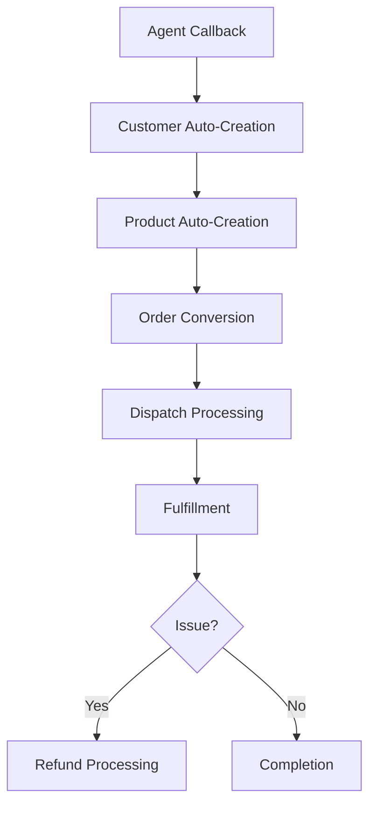

# AutoXpress CRM - Comprehensive Technical Analysis

## Table of Contents
1. [System Overview](#system-overview)
2. [Architecture Analysis](#architecture-analysis)
3. [Data Flow & Business Logic](#data-flow--business-logic)
4. [Frontend Architecture](#frontend-architecture)
5. [Backend Controllers](#backend-controllers)
6. [Model Layer](#model-layer)
7. [Database Schema](#database-schema)
8. [Real-time Features](#real-time-features)
9. [Security & Authentication](#security--authentication)
10. [Technical Patterns](#technical-patterns)

---

## System Overview

**AutoXpress CRM** is a sophisticated Ruby on Rails 7 application designed for automotive parts sales and customer relationship management. The system leverages modern web technologies including Hotwire (Turbo + Stimulus), ActionCable, and advanced Rails patterns to deliver a real-time, interactive user experience.

### Key Capabilities
- **Lead Management**: Agent callback system with conversion tracking
- **Order Processing**: Complete order lifecycle from callback to fulfillment
- **Dispatch Management**: Sophisticated supply chain coordination
- **Refund Processing**: Multi-stage refund workflows with resolution tracking
- **Real-time Dashboard**: Live metrics and activity tracking
- **Customer Management**: Comprehensive customer data with marketing attribution

---

## Architecture Analysis

### Technology Stack
```ruby
# Core Technologies
Rails 7.1 + Hotwire (Turbo + Stimulus)
ActionCable for WebSockets
Devise for Authentication
Bootstrap 5 + Custom SCSS
SQLite (Development) / PostgreSQL (Production)
```

### Application Structure
```
├── Models (Data Layer)
│   ├── Core Business Logic
│   ├── Polymorphic Activity Tracking
│   └── Auto-creation Workflows
├── Controllers (API Layer)
│   ├── RESTful Resources
│   ├── Turbo Stream Responses
│   └── Real-time Broadcasting
├── Views (Presentation Layer)
│   ├── Turbo Frame Navigation
│   ├── Turbo Stream Updates
│   └── Stimulus Interactions
└── JavaScript (Behavior Layer)
    ├── Stimulus Controllers
    ├── Form Enhancements
    └── Real-time Calculations
```

---

## Data Flow & Business Logic

### 1. Lead-to-Revenue Flow



### 2. Core Business Entities

#### **Agent Callbacks** (`app/models/agent_callback.rb`)
- **Purpose**: Initial lead capture from sales agents
- **Auto-creation**: Automatically creates Customer and Product records
- **Status Flow**: `pending` → `contacted` → `converted` → `cancelled`
- **Broadcasting**: Real-time updates to dashboard and callback list

```ruby
# Key Features
after_create_commit :auto_create_customer_and_product
after_update_commit :broadcast_updates
has_one :order, dependent: :destroy
```

#### **Customers** (`app/models/customer.rb`)
- **Marketing Attribution**: UTM tracking, GCLID capture
- **Status Management**: `active`, `inactive`, `vip`
- **Data Integration**: Phone-based deduplication
- **Activity Tracking**: All interactions tracked via polymorphic association

#### **Products** (`app/models/product.rb`)
- **Dynamic Creation**: Auto-generated from callback data
- **Pricing Logic**: Vendor cost + markup calculations
- **Vehicle Compatibility**: Text-based compatibility matrix
- **Source Tracking**: Differentiates callback vs manual creation

#### **Orders** (`app/models/order.rb`)
- **Unified Status System**: 10-stage status progression
- **Financial Calculations**: Product + tax + shipping = total
- **Timeline Generation**: Auto-generated status history
- **Dispatch Integration**: One-to-one relationship with dispatches

```ruby
# Status Progression
pending → confirmed → processing → dispatched → 
shipped → delivered → completed → cancelled → refunded → exchanged
```

#### **Dispatches** (`app/models/dispatch.rb`)
- **Supply Chain Management**: Supplier coordination and cost tracking
- **Payment Processing**: Multi-processor support (Stripe, PayPal, etc.)
- **Shipment Tracking**: Integration with shipping providers
- **Profit Calculation**: Real-time margin analysis

#### **Refunds** (`app/models/refund.rb`)
- **Multi-stage Processing**: 6-stage workflow
- **Resolution Options**: Refund, exchange, replacement
- **Financial Tracking**: Original vs refund amounts
- **Integration**: Creates replacement orders when needed

---

## Frontend Architecture

### Turbo Streams Implementation

#### **Real-time Broadcasting Channels**
```erb
<!-- Dashboard -->
<%= turbo_stream_from "dashboard" %>

<!-- Entity-specific channels -->
<%= turbo_stream_from "orders" %>
<%= turbo_stream_from "dispatches" %>
<%= turbo_stream_from "callbacks" %>
<%= turbo_stream_from "refunds" %>
```

#### **Model Broadcasting Patterns**
```ruby
# In models with Trackable concern
after_update_commit -> { broadcast_replace_to "dashboard" }
after_create_commit -> { broadcast_prepend_to entity_channel }
after_destroy_commit -> { broadcast_remove_to entity_channel }
```

### Turbo Frames Navigation

#### **Primary Navigation Frame**
```erb
<%= turbo_frame_tag "main_content" do %>
  <!-- All main content rendered here -->
<% end %>
```

#### **Seamless Navigation Links**
```erb
<%= link_to "Orders", orders_path, 
    data: { turbo_frame: "main_content" } %>
```

### Stimulus Controllers

#### **1. Order Form Controller** (`order_form_controller.js`)
```javascript
// Advanced Features
- Callback selection with auto-population
- Real-time total calculations
- Customer address validation
- Product pricing updates
- Keyboard shortcuts (Escape, Ctrl+S)
```

#### **2. Dispatch Form Controller** (`dispatch_form_controller.js`)
```javascript
// Profit Analysis
calculateProfit() {
  const customerTotal = parseFloat(this.customerTotalTarget.textContent)
  const supplierCost = parseFloat(this.supplierCostTarget.value)
  const profit = customerTotal - supplierCost
  this.updateProfitDisplay(profit)
  this.updateProfitStyling(profit) // Red/green based on margin
}

// Timeline Updates
updateTimelineProgress(status) {
  // Animated progress indicators
  // Status-based styling and icons
}
```

#### **3. Modal Controller** (`modal_controller.js`)
```javascript
// Unified Modal System
- Theme support (blue, green, red, yellow)
- Smart navigation on close
- Click-outside handling
- Keyboard shortcuts
- Dynamic content loading
```

### CSS Architecture

#### **Unified Modal System** (`_unified_modals.scss`)
```scss
.unified-modal {
  // Base modal styles
  &.theme-blue { /* Blue theme */ }
  &.theme-green { /* Success theme */ }
  &.theme-red { /* Error theme */ }
  &.theme-yellow { /* Warning theme */ }
  
  // Animations
  .modal-enter { /* Entry animation */ }
  .modal-exit { /* Exit animation */ }
}
```

#### **Dispatch Flow Visualization** (`dispatches.scss`)
```scss
.dispatch-flow-view {
  // Kanban-style layout
  .flow-streams {
    display: grid;
    grid-template-columns: repeat(auto-fit, minmax(300px, 1fr));
    gap: 1rem;
  }
  
  .flow-card {
    // Status-based styling
    &.status-pending { border-left: 4px solid #ffc107; }
    &.status-processing { border-left: 4px solid #007bff; }
    &.status-completed { border-left: 4px solid #28a745; }
  }
}
```

---

## Backend Controllers

### Application Controller (`application_controller.rb`)
```ruby
class ApplicationController < ActionController::Base
  before_action :authenticate_user!
  before_action :set_current_attributes
  
  private
  
  def set_current_attributes
    Current.user = current_user
    Current.ip_address = request.remote_ip
    Current.user_agent = request.user_agent
  end
end
```

### Dashboard Controller (`dashboard_controller.rb`)
```ruby
# Complex Metrics Calculation
def index
  @stats = {
    total_callbacks: AgentCallback.count,
    pending_orders: Order.where(order_status: 'pending').count,
    # ... 15+ different metrics
  }
  
  @chart_data = {
    callbacks_by_day: callbacks_chart_data,
    orders_by_status: orders_status_data,
    # Real-time chart data generation
  }
end

private

def callbacks_chart_data
  # Complex aggregation queries for Chart.js
  AgentCallback.group_by_day(:created_at, last: 7)
              .group(:status).count
              .transform_keys { |date, status| [date.strftime('%m/%d'), status.humanize] }
end
```

### Orders Controller (`orders_controller.rb`)
```ruby
# Advanced Features
- Dual view modes (cards/table)
- AJAX endpoints for real-time data
- Callback conversion workflow
- Status filtering and search
- Turbo Stream responses for all actions
```

### Dispatches Controller (`dispatches_controller.rb`)
```ruby
# Sophisticated Dispatch Management
def cancel
  @dispatch.update!(dispatch_status: 'cancelled')
  
  # Create refund if payment processed
  if @dispatch.payment_status == 'completed'
    @refund = create_refund_for_dispatch(@dispatch)
  end
  
  # Broadcast updates
  broadcast_replace_to "dispatches"
  broadcast_replace_to "dashboard"
  
  respond_to do |format|
    format.turbo_stream
    format.html { redirect_to dispatches_path }
  end
end
```

---

## Model Layer

### Activity Tracking System

#### **Trackable Concern** (`concerns/trackable.rb`)
```ruby
module Trackable
  extend ActiveSupport::Concern
  
  included do
    has_many :activities, as: :trackable, dependent: :destroy
    after_update_commit :track_changes
    after_create_commit :track_creation
  end
  
  private
  
  def track_changes
    # Automatically tracks all field changes
    changes_to_track.each do |field, (old_val, new_val)|
      activities.create!(
        user: Current.user,
        action: 'updated',
        field_changed: field,
        old_value: old_val,
        new_value: new_val,
        # ... metadata
      )
    end
    broadcast_activity_update
  end
end
```

#### **Activity Model** (`activity.rb`)
```ruby
class Activity < ApplicationRecord
  # Polymorphic association to any trackable model
  belongs_to :trackable, polymorphic: true
  belongs_to :user
  
  # Real-time broadcasting
  after_create_commit -> { broadcast_prepend_to "dashboard" }
  
  scope :recent, -> { order(created_at: :desc).limit(50) }
  scope :for_entity, ->(entity) { where(trackable: entity) }
end
```

### Auto-creation Workflows

#### **Agent Callback Auto-creation** (`agent_callback.rb`)
```ruby
after_create_commit :auto_create_customer_and_product

private

def auto_create_customer_and_product
  # Smart customer matching/creation
  customer = Customer.find_by(phone_number: phone_number) ||
             Customer.create!(customer_attributes)
  
  # Dynamic product creation
  product = Product.create!(
    name: product,
    description: "Auto-created from callback ##{id}",
    vehicle_compatibility: "#{year} #{car_make_model}",
    source: 'callback'
  )
  
  # Activity tracking
  activities.create!(
    user: user,
    action: 'auto_created_related',
    details: "Created Customer ##{customer.id} and Product ##{product.id}"
  )
end
```

---

## Database Schema

### Key Relationships
```sql
-- Polymorphic Activity Tracking
activities: trackable_type, trackable_id → any model

-- Core Business Flow
agent_callbacks → customers (auto-created)
agent_callbacks → products (auto-created)  
agent_callbacks → orders (converted)
orders → dispatches (1:1 relationship)
orders → refunds (1:many relationship)

-- User Association
users → agent_callbacks (created_by)
users → activities (performed_by)
users → dispatches (processing_agent)
users → refunds (processing_agent)
```

### Indexing Strategy
```sql
-- Performance indexes for common queries
CREATE INDEX idx_activities_trackable ON activities(trackable_type, trackable_id);
CREATE INDEX idx_orders_status ON orders(order_status);
CREATE INDEX idx_dispatches_status ON dispatches(dispatch_status);
CREATE INDEX idx_customers_phone ON customers(phone_number);
CREATE UNIQUE INDEX idx_orders_number ON orders(order_number);
```

### Enum Definitions
```ruby
# Order Statuses (10 stages)
enum order_status: {
  pending: 0, confirmed: 1, processing: 2, dispatched: 3,
  shipped: 4, delivered: 5, completed: 6, cancelled: 7,
  refunded: 8, exchanged: 9
}

# Dispatch Statuses (6 stages)
enum dispatch_status: {
  pending: 0, processing: 1, shipped: 2,
  delivered: 3, completed: 4, cancelled: 5
}

# Refund Stages (6 stages)
enum refund_stage: {
  initiated: 0, processing: 1, approved: 2,
  completed: 3, cancelled: 4, pending_resolution: 5
}
```

---

## Real-time Features

### ActionCable Integration

#### **Broadcasting Patterns**
```ruby
# Model-level broadcasting
class Order < ApplicationRecord
  after_update_commit -> { broadcast_replace_to "orders" }
  after_create_commit -> { broadcast_prepend_to "orders" }
  
  # Dashboard metrics update
  after_save_commit -> { broadcast_replace_to "dashboard", 
                        target: "dashboard-metrics",
                        partial: "dashboard/metrics",
                        locals: { stats: Dashboard.calculate_stats } }
end
```

#### **Client-side Reception**
```erb
<!-- Auto-subscribes to streams -->
<%= turbo_stream_from "dashboard" %>
<%= turbo_stream_from "orders" %>

<!-- Updates happen automatically -->
<div id="dashboard-metrics">
  <%= render 'dashboard/metrics', stats: @stats %>
</div>
```

### Live Dashboard Updates

#### **Metrics Broadcasting** (`dashboard_controller.rb`)
```ruby
# Real-time metrics calculation
def broadcast_metrics_update
  fresh_stats = {
    total_callbacks: AgentCallback.count,
    pending_orders: Order.pending.count,
    active_dispatches: Dispatch.where.not(dispatch_status: 'completed').count,
    today_revenue: Order.where(order_date: Date.current).sum(:total_amount)
    # ... 15+ real-time metrics
  }
  
  Turbo::StreamsChannel.broadcast_replace_to(
    "dashboard",
    target: "dashboard-metrics", 
    partial: "dashboard/metrics",
    locals: { stats: fresh_stats }
  )
end
```

---

## Security & Authentication

### Devise Integration
```ruby
# User model with Devise
class User < ApplicationRecord
  devise :database_authenticatable, :registerable,
         :recoverable, :rememberable, :validatable
end

# Controller protection
class ApplicationController < ActionController::Base
  before_action :authenticate_user!
  protect_from_forgery with: :exception
end
```

### Activity Auditing
```ruby
# All model changes tracked
module Trackable
  def track_changes
    # Captures:
    # - User who made change
    # - IP address
    # - User agent
    # - Timestamp
    # - Old/new values
    # - Action type
  end
end
```

---

## Technical Patterns

### 1. **Unified Status Badge System**
```ruby
# Used across Order, Dispatch, Refund models
def status_badge_class
  case status.to_s
  when 'pending' then 'badge-warning'
  when 'completed' then 'badge-success'
  when 'cancelled' then 'badge-danger'
  # ... unified styling
  end
end
```

### 2. **Polymorphic Activity Tracking**
```ruby
# Single activities table tracks all model changes
belongs_to :trackable, polymorphic: true

# Usage:
order.activities.create!(action: 'status_changed')
customer.activities.create!(action: 'contact_updated')
```

### 3. **Auto-creation Workflows**
```ruby
# Callbacks automatically create related records
after_create_commit :auto_create_customer_and_product

# Orders automatically create dispatches
after_create_commit :auto_create_dispatch
```

### 4. **Turbo Stream Broadcasting Guards**
```ruby
# Prevent unnecessary broadcasts
after_update_commit :broadcast_updates, if: :should_broadcast?

private

def should_broadcast?
  # Only broadcast for significant changes
  saved_changes.keys.intersect?(%w[status order_status dispatch_status])
end
```

### 5. **Progressive Enhancement**
- All forms work without JavaScript
- Stimulus enhances with real-time features
- Turbo provides SPA-like navigation
- Graceful degradation for older browsers

---

## Performance Considerations

### Database Optimization
- Strategic indexing on frequently queried fields
- Polymorphic indexes for activity tracking
- Enum columns for status fields (integer storage)

### Frontend Performance
- Turbo Frame lazy loading
- Targeted DOM updates via Turbo Streams
- Debounced search inputs
- Efficient CSS with minimal reflows

### Caching Strategy
- Fragment caching for dashboard metrics
- Russian doll caching for nested components
- ActionCable connection pooling

---

## Conclusion

AutoXpress CRM demonstrates sophisticated use of modern Rails patterns and technologies. The application successfully combines:

1. **Real-time Updates**: Comprehensive Turbo Streams broadcasting
2. **Interactive UI**: Advanced Stimulus controllers with rich behavior
3. **Data Integrity**: Polymorphic activity tracking for complete audit trails
4. **Business Logic**: Complex workflow automation and status management
5. **Performance**: Optimized database queries and efficient frontend updates
6. **User Experience**: SPA-like navigation with progressive enhancement

The system provides a solid foundation for automotive parts sales operations while maintaining flexibility for future enhancements and scaling.

---

*Analysis completed on: May 27, 2025*  
*Rails Version: 7.1*  
*Generated by: Claude Code Analysis*