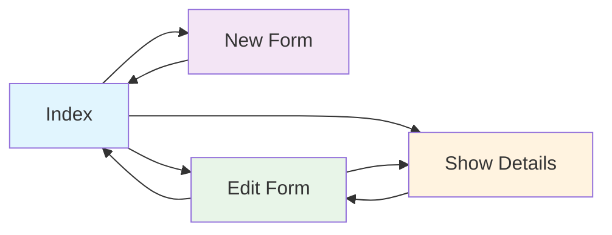

# AutoXpress CRM

This is a Ruby on Rails application for managing automotive customer callbacks and CRM operations.

## Turbo Frames Implementation Guide

### Complete Step-by-Step Instructions for Adding Turbo Frames to Any Model

Follow these exact steps to implement seamless navigation with Turbo Frames:

#### 1. Install Turbo Rails Properly
```bash
bin/rails turbo:install
```
This command will:
- Add turbo-rails to importmap.rb
- Update application.js to import turbo

#### 2. Verify Turbo Loading in JavaScript
Add this to `app/javascript/application.js`:
```javascript
import "@hotwired/turbo-rails"
import "./callbacks"

// Verify Turbo is loaded
console.log("Turbo loaded:", window.Turbo ? "yes" : "no")
```

#### 3. Index View Setup
Wrap the main content in a turbo frame and add data attributes to navigation links:

```erb
<!-- app/views/callbacks/index.html.erb -->
<main class="main-content">
    <%= turbo_frame_tag "main_content" do %>
        <header class="main-header">
            <!-- Header content -->
            <div class="header-actions">
                <%= link_to new_callback_path, class: "btn btn-primary", data: { turbo_frame: "main_content" } do %>
                    <i class="fas fa-plus"></i>
                    Add Callback
                <% end %>
            </div>
        </header>
        
        <!-- Rest of your index content (tables, lists, etc.) -->
        
    <% end %>
</main>
```

#### 4. New/Edit View Setup
Use the same turbo frame ID and add data attributes to back/cancel links:

```erb
<!-- app/views/callbacks/new.html.erb -->
<main class="main-content">
    <%= turbo_frame_tag "main_content" do %>
        <header class="main-header">
            <!-- Header content -->
            <div class="header-actions">
                <%= link_to callbacks_path, class: "btn btn-secondary", data: { turbo_frame: "main_content" } do %>
                    <i class="fas fa-arrow-left"></i>
                    Back to Callbacks
                <% end %>
            </div>
        </header>
        
        <div class="content-card">
            <%= form_with model: @callback, url: callbacks_path, local: true, class: "callback-form" do |form| %>
                <!-- Form fields -->
                
                <div class="form-actions">
                    <%= link_to "Cancel", callbacks_path, class: "btn btn-secondary", data: { turbo_frame: "main_content" } %>
                    <%= form.submit "Create Callback", class: "btn btn-primary" %>
                </div>
            <% end %>
        </div>
    <% end %>
</main>
```

#### 5. Form Configuration Rules
- **ALWAYS use `local: true`** in `form_with` for turbo frames to work properly
- **DO NOT use `local: false`** - this breaks turbo frame behavior
- **DO NOT add `data: { turbo_frame: "frame_id" }`** to the form itself - forms automatically submit within their containing frame

#### 6. Controller Requirements
No special changes needed in the controller. Standard redirect and validation behavior works:

```ruby
def create
  @callback = AgentCallback.new(callback_params)
  
  if @callback.save
    redirect_to callbacks_path, notice: 'Callback was successfully created.'
  else
    render :new, status: :unprocessable_entity  # This renders errors within turbo frame
  end
end
```

#### 7. Validation Error Handling
Add error display to your form view:

```erb
<% if @callback.errors.any? %>
    <div class="alert alert-danger">
        <h4><%= pluralize(@callback.errors.count, "error") %> prohibited this callback from being saved:</h4>
        <ul>
            <% @callback.errors.full_messages.each do |message| %>
                <li><%= message %></li>
            <% end %>
        </ul>
    </div>
<% end %>
```

Add CSS for error styling:
```scss
.alert-danger {
    color: #721c24;
    background-color: #f8d7da;
    border-color: #f5c6cb;
    padding: 16px;
    margin-bottom: 24px;
    border-radius: 8px;
}

.field_with_errors input,
.field_with_errors select,
.field_with_errors textarea {
    border-color: #dc3545 !important;
    box-shadow: 0 0 0 0.2rem rgba(220, 53, 69, 0.25) !important;
}
```

#### 8. Critical Requirements Checklist
- [ ] `bin/rails turbo:install` has been run
- [ ] Browser console shows "Turbo loaded: yes"
- [ ] Both views use identical `turbo_frame_tag` ID (e.g., "main_content")
- [ ] Navigation links include `data: { turbo_frame: "main_content" }`
- [ ] Forms use `local: true` (not `local: false`)
- [ ] Forms do NOT have `data: { turbo_frame: "frame_id" }` attribute
- [ ] Error handling added to form views for validation failures
- [ ] CSS styling added for error alerts and field highlighting

#### 9. Troubleshooting
If turbo frames aren't working:

1. **Check console**: Should show "Turbo loaded: yes"
2. **Check Network tab**: Requests should include `Turbo-Frame: main_content` header
3. **Verify frame IDs**: Must be identical in both views
4. **Check form config**: Must use `local: true`
5. **Restart server**: After turbo installation

### Example for Other Models
To implement this pattern for any other model (e.g., `products`):

1. Replace `callbacks` with your model name in paths
2. Replace `@callback` with your instance variable
3. Use the same turbo frame ID across related views
4. Follow the exact form configuration rules above

## Ruby version
* Ruby 3.2.2

## System dependencies
* Redis server

## Live Broadcasting Implementation Guide

### Real-time Updates with Turbo Streams

The callbacks table now supports live broadcasting - users will see real-time updates when callbacks are created, updated, or deleted across all browser sessions.

#### How It Works

1. **Model Broadcasting**: The `AgentCallback` model automatically broadcasts changes:
```ruby
# app/models/agent_callback.rb
after_create_commit { broadcast_prepend_to "callbacks", target: "callbacks" }
after_update_commit { broadcast_replace_to "callbacks" }
after_destroy_commit { broadcast_remove_to "callbacks" }
```

2. **View Subscription**: The index view subscribes to live updates:
```erb
<!-- app/views/callbacks/index.html.erb -->
<%= turbo_stream_from "callbacks" %>
<tbody id="callbacks">
  <% @callbacks.each do |callback| %>
    <tr id="<%= dom_id(callback) %>">
      <!-- callback data -->
    </tr>
  <% end %>
</tbody>
```

3. **Partial Template**: Individual callback rows are rendered using:
```erb
<!-- app/views/agent_callbacks/_agent_callback.html.erb -->
<tr id="<%= dom_id(agent_callback) %>">
  <!-- callback row content -->
</tr>
```

4. **Controller Support**: Controllers handle turbo stream responses:
```ruby
def create
  respond_to do |format|
    if @callback.save
      format.html { redirect_to callbacks_path, notice: 'Callback was successfully created.' }
      format.turbo_stream { redirect_to callbacks_path, notice: 'Callback was successfully created.' }
    else
      format.html { render :new, status: :unprocessable_entity }
      format.turbo_stream { render :new, status: :unprocessable_entity }
    end
  end
end
```

#### Live Update Behaviors

- **New Callback Created**: Appears at the top of the table instantly
- **Callback Updated**: Row updates with new data in real-time
- **Callback Deleted**: Row disappears immediately

#### Requirements for Live Broadcasting

1. **Redis Server**: Must be running for ActionCable
   ```bash
   redis-server
   ```

2. **Cable Configuration**: Already set up in `config/cable.yml`:
   ```yaml
   development:
     adapter: async
   production:
     adapter: redis
   ```

3. **ActionCable Integration**: No additional JavaScript imports needed - Turbo Rails handles ActionCable automatically

#### Testing Live Broadcasting

1. Open multiple browser windows to the callbacks index
2. Create/edit/delete a callback in one window
3. Watch the changes appear instantly in all other windows
4. Check browser network tab for WebSocket connections

#### Troubleshooting Live Updates

- **No live updates**: Check if Redis is running
- **WebSocket errors**: Verify ActionCable routes in `config/routes.rb`
- **Updates not appearing**: Ensure `turbo_stream_from "callbacks"` is in the view
- **Wrong target**: Verify `tbody id="callbacks"` matches the broadcast target

## Dashboard Live Broadcasting Implementation

### Real-Time Dashboard with Perfect Layout Preservation

The dashboard implements sophisticated live broadcasting that maintains perfect styling and layout even during real-time updates. This was a complex challenge that required careful attention to CSS layout preservation during Turbo Stream broadcasts.

#### The Dashboard Broadcasting Challenge

**Problem**: When Turbo Streams broadcast updates to dashboard partials, the CSS layouts would collapse because:
1. Grid and flexbox containers would lose their layout properties
2. Spacing and margins wouldn't be preserved
3. Responsive design would break
4. The broadcast partials didn't include proper wrapper elements

**Solution**: We implemented broadcast-proof partials with inline layout styles and comprehensive CSS with `!important` declarations.

#### Dashboard Broadcasting Architecture

**1. Multi-Level Broadcasting System**
```ruby
# app/models/agent_callback.rb - Dashboard metrics broadcasting
after_create_commit { broadcast_dashboard_metrics }
after_update_commit { broadcast_dashboard_metrics }
after_destroy_commit { broadcast_dashboard_metrics }

def broadcast_dashboard_metrics
  Rails.logger.info "=== DASHBOARD METRICS BROADCAST TRIGGERED ==="
  stats = calculate_fresh_stats
  
  broadcast_replace_to "dashboard", 
                      target: "dashboard-metrics", 
                      partial: "dashboard/metrics", 
                      locals: { stats: stats }
end
```

```ruby
# app/models/activity.rb - Dashboard activity feed broadcasting
after_create_commit :broadcast_dashboard_activity_update

def broadcast_dashboard_activity_update
  recent_activities = Activity.includes(:user, :trackable)
                             .where(trackable_type: 'AgentCallback')
                             .order(created_at: :desc)
                             .limit(8)
  
  broadcast_replace_to "dashboard", 
                      target: "dashboard-activity", 
                      partial: "dashboard/activity_feed", 
                      locals: { activities: recent_activities }
end
```

**2. Broadcast-Proof Partial Design**

**Metrics Partial (`_metrics.html.erb`)**:
```erb
<div style="display: grid; grid-template-columns: repeat(auto-fit, minmax(280px, 1fr)); gap: 1.5rem; margin-bottom: 2.5rem; width: 100%;">
  <div class="metric-card primary">
    <!-- Metric content -->
  </div>
  <!-- More metric cards -->
</div>
```

**Activity Feed Partial (`_activity_feed.html.erb`)**:
```erb
<div style="display: flex; flex-direction: column; gap: 1rem; max-height: 450px; overflow-y: auto; padding-right: 0.5rem; width: 100%;">
  <% activities.each do |activity| %>
    <div class="activity-item">
      <!-- Activity content -->
    </div>
  <% end %>
</div>
```

**3. Key Broadcasting Fixes Applied**

**Critical Callback Fix**: 
The biggest issue was a method name mismatch:
```ruby
# ❌ WRONG - callbacks called wrong method name
after_create_commit { broadcast_dashboard_metrics }

# But method was named:
def broadcast_dashboard_metrics_update  # ❌ Different name!

# ✅ FIXED - method name matches callback
def broadcast_dashboard_metrics
```

**Inline Layout Preservation**:
- Added `style="display: grid; ..."` directly to broadcast partials
- Ensured layout properties are preserved during DOM replacement
- Added proper bottom margins to prevent spacing collapse

**CSS Architecture with !important**:
```scss
.metrics-grid {
  display: grid !important;
  grid-template-columns: repeat(auto-fit, minmax(280px, 1fr)) !important;
  gap: 1.5rem !important;
  margin-bottom: 2.5rem !important;
  width: 100% !important;
}

.activity-feed {
  display: flex !important;
  flex-direction: column !important;
  gap: 1rem !important;
  max-height: 450px !important;
  overflow-y: auto !important;
}
```

#### Dashboard Features with Live Broadcasting

**1. Real-Time Metrics Updates**
- Total leads count updates instantly
- Sales closed count updates in real-time  
- Conversion rate recalculates automatically
- Follow-ups due counter updates live
- Timestamps show last update time

**2. Live Activity Feed**
- New activities appear instantly at the top
- User actions broadcast across all sessions
- Status changes show with visual badges
- Activity icons indicate action types (create/update/view)

**3. Responsive Design Preservation**
- Grid layouts remain intact during broadcasts
- Mobile responsiveness works with live updates
- Spacing and margins preserved across screen sizes
- Brand red color theme maintained throughout

**4. Professional Dashboard Features**
- AutoXpress red brand integration throughout
- Modern gradients and animations
- Custom scrollbars with brand colors
- Hover effects and micro-interactions
- Top performer rankings with badges
- Conversion funnel visualization

#### Broadcasting Debugging Process

**1. The Debug Journey**
```bash
# Logs showed activity broadcasts working:
[ActionCable] Broadcasting to dashboard: "<turbo-stream action=\"replace\" target=\"dashboard-activity\">...
Turbo::StreamsChannel transmitting ... (via streamed from dashboard)

# But no metrics broadcasts appeared - indicating method not executing
# Led us to discover the method name mismatch
```

**2. Testing Live Updates**
```ruby
# Added comprehensive debug logging:
def broadcast_dashboard_metrics
  Rails.logger.info "=== DASHBOARD METRICS BROADCAST TRIGGERED ==="
  stats = calculate_fresh_stats
  Rails.logger.info "Stats: #{stats}"
  
  broadcast_replace_to "dashboard", 
                      target: "dashboard-metrics", 
                      partial: "dashboard/metrics", 
                      locals: { stats: stats }
                      
  Rails.logger.info "=== DASHBOARD METRICS BROADCAST SENT ==="
end
```

**3. Layout Preservation Testing**
- Opened multiple browser windows to dashboard
- Created/updated callbacks in one window
- Verified layouts remained intact in other windows
- Tested responsive behavior during live updates

#### Dashboard Broadcasting Best Practices

**1. Always Use Inline Styles for Critical Layout**
```erb
<!-- ✅ GOOD - Layout preserved during broadcast -->
<div style="display: grid; grid-template-columns: repeat(auto-fit, minmax(280px, 1fr)); gap: 1.5rem;">

<!-- ❌ BAD - Layout could collapse -->
<div class="metrics-grid">
```

**2. Method Name Consistency**
```ruby
# ✅ GOOD - Callback and method names match
after_create_commit { broadcast_dashboard_metrics }
def broadcast_dashboard_metrics

# ❌ BAD - Names don't match, callback won't execute  
after_create_commit { broadcast_dashboard_metrics }
def broadcast_dashboard_metrics_update
```

**3. Comprehensive CSS with !important**
```scss
// ✅ GOOD - Ensures styles persist through broadcasts
.metric-card {
  display: flex !important;
  align-items: center !important;
  gap: 1.25rem !important;
}

// ❌ BAD - Styles might be lost during DOM replacement
.metric-card {
  display: flex;
  align-items: center;
  gap: 1.25rem;
}
```

**4. Proper Error Handling and Logging**
```ruby
def broadcast_dashboard_metrics
  begin
    Rails.logger.info "Dashboard broadcast starting..."
    stats = calculate_fresh_stats
    broadcast_replace_to "dashboard", target: "dashboard-metrics", 
                        partial: "dashboard/metrics", locals: { stats: stats }
    Rails.logger.info "Dashboard broadcast completed successfully"
  rescue => e
    Rails.logger.error "Dashboard broadcast failed: #{e.message}"
  end
end
```

#### Testing Dashboard Broadcasting

**Manual Testing Checklist:**
- [ ] Open multiple browser windows to dashboard
- [ ] Create a new callback in one window
- [ ] Verify metrics update in all other windows
- [ ] Verify activity feed updates in real-time
- [ ] Check that grid layouts remain intact
- [ ] Test responsive behavior during updates
- [ ] Verify brand styling is preserved
- [ ] Check browser console for any errors

**What Should Happen:**
- ✅ Metrics cards maintain grid layout during updates
- ✅ Activity feed maintains flex layout and scrolling
- ✅ Timestamps update to show current time
- ✅ All spacing and margins remain consistent
- ✅ Red brand theme is preserved throughout
- ✅ Responsive design works with live updates

**Common Issues and Fixes:**
- **Cards stack vertically**: Add inline grid styles to partial
- **Missing bottom margins**: Add `margin-bottom` to partial wrapper
- **Layout collapse**: Use `!important` in CSS for critical properties
- **Broadcasts not firing**: Check method name matches callback
- **Responsive breaks**: Add width: 100% to partial wrapper

## Complete Turbo & Turbo Stream Implementation

### Our Advanced Implementation Strategy

This CRM application implements a sophisticated dual-mode Turbo system that seamlessly combines **Turbo Frames** for navigation and **Turbo Streams** for real-time updates and validation handling.

#### The Challenge We Solved

We needed to create a seamless user experience that:
1. Provides instant navigation between views (no page refreshes)
2. Shows real-time updates across all browser sessions
3. Handles form validation errors gracefully within frames
4. Maintains all JavaScript functionality and styling

#### Our Dual-Template Solution

For each action that might be called within a Turbo Frame, we created **two templates**:

**1. Regular Templates** (`.html.erb`)
- Used for full-page loads and direct URL access
- Wrapped in `turbo_frame_tag "main_content"`
- Maintains backward compatibility

**2. Turbo Stream Templates** (`.turbo_stream.erb`)
- Used for validation errors and dynamic updates
- Uses `turbo_stream.replace` to update content
- Handles edge cases where frame content needs refreshing

#### Complete Flow Implementation



**Navigation Flow:**
- **Index** ↔ **New** ↔ **Index** (within turbo_frame)
- **Index** ↔ **Edit** ↔ **Index** (within turbo_frame)
- **Index** ↔ **Show** ↔ **Edit** ↔ **Show** (within turbo_frame)

#### File Structure We Created

```
app/views/callbacks/
├── index.html.erb              # Main list with turbo_frame
├── new.html.erb                # New form in turbo_frame
├── new.turbo_stream.erb        # New form validation errors
├── edit.html.erb               # Edit form in turbo_frame
├── edit.turbo_stream.erb       # Edit form validation errors
├── show.html.erb               # Detail view in turbo_frame
├── show.turbo_stream.erb       # Detail view errors (if needed)
└── _agent_callback.html.erb    # Partial for live broadcasting
```

#### Advanced Features Implemented

**1. User Assignment Logic**
- **Create**: Auto-assigns current user (non-editable)
- **Edit**: Can reassign to any agent (editable dropdown)
- **View**: Shows assigned agent with activity tracking

**2. Activity Tracking System**
```ruby
# Real-time activity broadcasting
class Activity < ApplicationRecord
  after_create_commit :broadcast_activity_update
  
  private
  
  def broadcast_activity_update
    broadcast_prepend_to "callback_#{trackable_id}_activities", 
                        target: "activity-list", 
                        partial: "activities/activity"
    broadcast_update_to "callback_#{trackable_id}_activities", 
                       target: "activity-count", 
                       html: trackable.activities.count.to_s
  end
end
```

**3. Multi-Level Broadcasting**
- **Callback Level**: Updates main callbacks table
- **Activity Level**: Updates individual callback activity logs
- **Metrics Level**: Updates performance counters in real-time

**4. Form Enhancement Features**
- Phone number auto-formatting
- Loading states with spinners
- Professional section organization with icons
- Comprehensive validation error handling

#### Technical Implementation Details

**Controller Pattern:**
```ruby
def create
  @callback = current_user.agent_callbacks.build(callback_params)
  
  respond_to do |format|
    if @callback.save
      format.html { redirect_to callbacks_path, notice: 'Success!' }
      format.turbo_stream { redirect_to callbacks_path, notice: 'Success!' }
    else
      format.html { render :new, status: :unprocessable_entity }
      format.turbo_stream { render :new, status: :unprocessable_entity }
    end
  end
end
```

**View Pattern:**
```erb
<!-- Regular template -->
<%= turbo_frame_tag "main_content" do %>
  <!-- Content here -->
<% end %>

<!-- Turbo Stream template -->
<%= turbo_stream.replace "main_content" do %>
  <!-- Same content with error handling -->
<% end %>
```

**Link Configuration:**
```erb
<!-- Navigation within frames -->
<%= link_to "Edit", edit_path(@record), 
    data: { turbo_frame: "main_content" } %>

<!-- Forms break out of frames on success -->
<%= form_with model: @record, local: false, 
    data: { turbo_frame: "_top" } %>
```

#### Key Architectural Decisions

**1. Frame vs Stream Usage**
- **Turbo Frames**: Navigation and content switching
- **Turbo Streams**: Real-time updates and validation errors

**2. Template Strategy**
- **Dual templates**: Handles both frame and stream contexts
- **Shared partials**: Consistent rendering across contexts

**3. User Experience Design**
- **Non-blocking navigation**: Users can work while content loads
- **Real-time collaboration**: Multiple users see changes instantly
- **Progressive enhancement**: Works without JavaScript

#### Performance Benefits

1. **Reduced Server Load**: Only partial page updates
2. **Faster User Experience**: No full page reloads
3. **Real-time Collaboration**: Instant updates across sessions
4. **Improved SEO**: URLs still change for direct access
5. **Mobile Optimization**: Reduced data transfer

#### Future Extensibility

This pattern can be easily extended to:
- Add new models with the same dual-template approach
- Implement more complex real-time features
- Add mobile-specific optimizations
- Integrate with external APIs

#### Testing Strategy

**Manual Testing Workflow:**
1. Open multiple browser windows
2. Navigate between views in one window
3. Verify real-time updates appear in other windows
4. Test validation errors stay within frames
5. Confirm all JavaScript functionality works

**What to Test:**
- ✅ Turbo Frame navigation (no page refreshes)
- ✅ Real-time broadcasting (multi-window updates)
- ✅ Form validation (errors within frames)
- ✅ Activity tracking (live activity logs)
- ✅ User assignment logic (create vs edit behavior)

## Getting Started
* `bundle install`
* `rails db:create db:migrate db:seed`
* Start Redis: `redis-server`
* `rails server`

## Development Notes
* All forms use current user auto-assignment for security
* Activity tracking provides complete audit trail
* Real-time updates work across all browser sessions
* Mobile-responsive design with professional styling


 Complete Documentation Added:

  1. Advanced Implementation Strategy

  - Explains our dual-mode Turbo system
  - Details the challenges we solved
  - Shows the seamless navigation + real-time updates approach

  2. Dual-Template Solution

  - Documents our .html.erb + .turbo_stream.erb pattern
  - Explains when each template is used
  - Shows backward compatibility approach

  3. Complete Flow Visualization

  - Navigation flow between Index ↔ New ↔ Edit ↔ Show
  - Visual Mermaid diagram of the relationships
  - Clear explanation of turbo_frame navigation

  4. File Structure Documentation

  - Complete list of all templates we created
  - Purpose of each file explained
  - Partial template usage documented

  5. Advanced Features Covered

  - User Assignment Logic: Create (auto-assign) vs Edit (changeable)
  - Activity Tracking System: Real-time broadcasting code examples
  - Multi-Level Broadcasting: Callback, Activity, and Metrics levels
  - Form Enhancements: Phone formatting, loading states, icons

  6. Technical Implementation Details

  - Controller Patterns: Exact code examples
  - View Patterns: Template structure examples
  - Link Configuration: How to set up turbo_frame data attributes

  7. Architectural Decisions

  - Why we chose Frames vs Streams for different use cases
  - Template strategy reasoning
  - User experience design principles

  8. Performance & Benefits

  - Reduced server load and faster UX
  - Real-time collaboration capabilities
  - SEO and mobile optimization benefits

  9. Future Extensibility

  - How to extend the pattern to new models
  - Scaling considerations
  - API integration possibilities

  10. Complete Testing Strategy

  - Manual testing workflow steps
  - Checklist of features to verify
  - Multi-window testing approach

  This documentation serves as both a reference guide for the current implementation and a blueprint for
  extending this pattern to other parts of the application. Anyone can now understand exactly how our
  sophisticated Turbo system works! 🎉